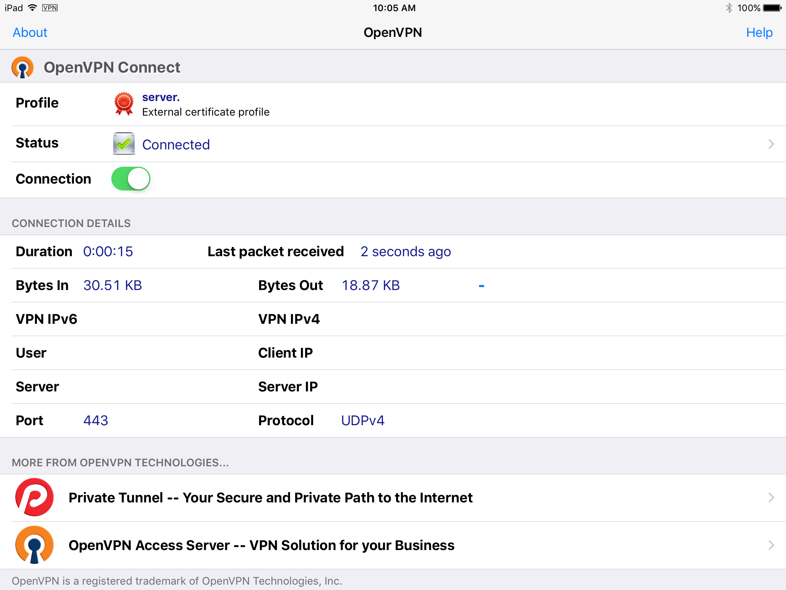

macos-openvpn-server
==================

# macOS OpenVPN Server and Client Configuration

This repo describes how to build an OpenVPN VPN server on macOS using pfctl and Tunnelblick.

This configuration provides a TLS-based VPN server using 4096-bit certificates and UDP port 443, accessible by any OpenVPN client, especially iOS with the OpenVPN app.



## VPN Configuration Advantages

This OpenVPN configuration provides the following advantages:

* Secure VPN networking for all mobile clients
* Secure, certificate-based VPN
    * OpenVPN the only certificate-based option between macOS and iOS
    * PPTP-based VPN traffic "[should be considered unencrypted](https://www.cloudcracker.com/blog/2012/07/29/cracking-ms-chap-v2/)"
    * L2TP VPN (available in macOS Server.app) requires a very long random PSK; "[IPSEC-PSK is arguably worse than PPTP … for a dictionary-based attack vector](https://www.cloudcracker.com/blog/2012/07/29/cracking-ms-chap-v2/)"
* PF-based [firewall security](../../../osxfortress) on the server
* Privatizing [Automatic Proxy Configuration](../../../osxfortress) for all mobile client devices
    * Mobile device networking through PF firewall security
    * Tracker blocking
    * Ad blocking
    * Malware blocking

## Privatizing Proxy for Mobile Devices

A privatizing proxy is necessary to block mobile carriers from adding uniquely identifying HTTP headers used for customer tracking. See, for example, __[
Does your phone company track you?](http://arstechnica.com/security/2014/11/does-your-phone-company-track-you/)__. The repo [essandess/osxfortress](../../../osxfortress) provides a firewall,
blackhole, and privatizing proxy . Use the server configuration
[config.ovpn.osxfortress](openvpn-server-tun.tblk/config.ovpn.osxfortress) for these features, including blocking the mobile carrier tracking headers:

```
# Mobile carrier uniquely identifying headers
request_header_access MSISDN deny all           # T-Mobile
request_header_access X-MSISDN deny all         # T-Mobile
request_header_access X-UIDH deny all           # Verizon
request_header_access x-up-subno deny all       # AT&T
request_header_access X-ACR deny all            # AT&T
request_header_access X-UP-SUBSCRIBER-COS deny all
request_header_access X-OPWV-DDM-HTTPMISCDD deny all
request_header_access X-OPWV-DDM-IDENTITY deny all
request_header_access X-OPWV-DDM-SUBSCRIBER deny all
request_header_access CLIENTID deny all
request_header_access X-VF-ACR deny all
request_header_access X_MTI_USERNAME deny all
request_header_access X_MTI_EMAIL deny all
request_header_access X_MTI_EMPID deny all
```
